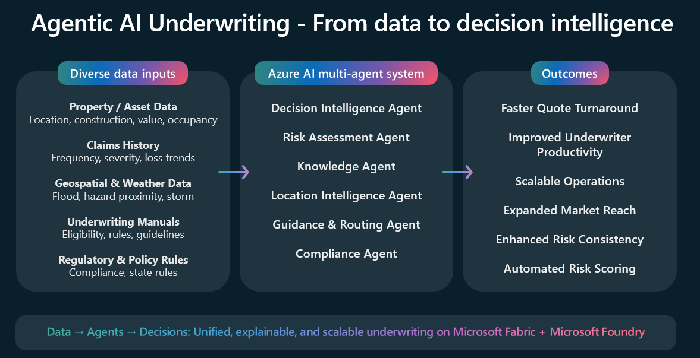
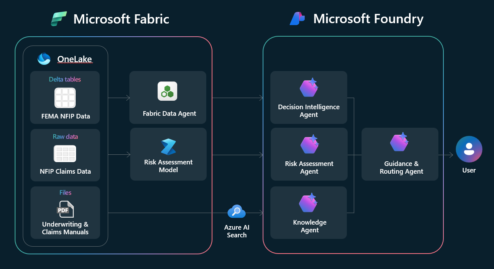
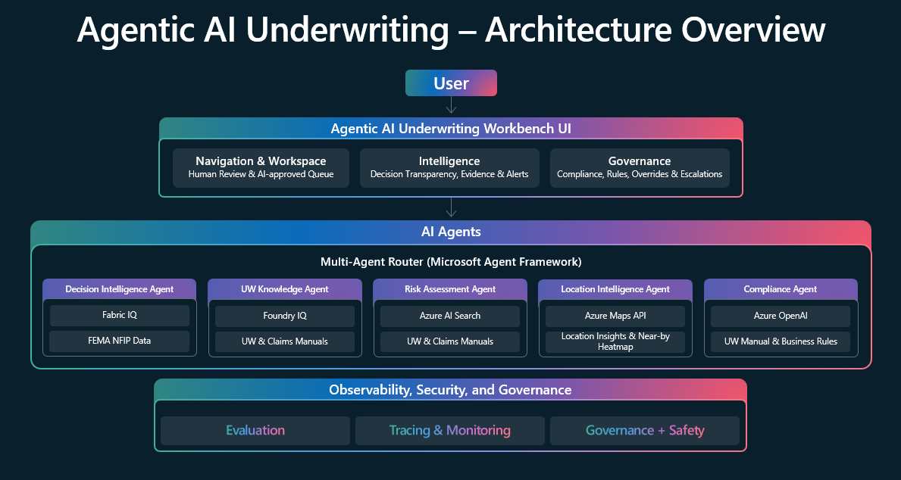

# Agentic Underwriting

An end-to-end underwriting copilot experience that combines a web UI with an agentic backend to accelerate case review, surface key risk signals, and produce explainable AI decision support.

## Business Value

- Automated risk scoring and faster quote decisions
- Human review guidance and routing for efficiency and control
- Transparent recommendations with explainability to support review
- Better alignment to policy and compliance expectations

## Solution Highlights

- Web experience optimized for underwriting workflows (case review + AI insights)
- API-first backend enabling copilot-style interactions
- Explainability-oriented outputs (how/why conclusions were produced)

## Key Features

- Case review experience with structured sections
- AI-assisted summaries and decision support
- Location/property intelligence and risk signals (where available)

## Architecture

This section shows two views:

- **Logical architecture**: a high-level view of how data sources feed an agent system to produce user-facing outcomes.
- **Reference architecture**: a more detailed view showing the UI workbench and agent roles.

### Multi-agent Architecture

## How to Use

1. Open the deployed UI URL.
2. Select a case and review the available panels.
3. Trigger AI/copilot actions as exposed in the UI.
4. Review outputs and validate against your underwriting process.

> This repository intentionally avoids publishing environment-specific URLs and secrets.

## Prerequisites (High-Level)

- Deployed UI endpoint (Azure App Service)
- Deployed backend endpoint (Azure App Service)
- Appropriate access to any required AI provider (credentials configured via environment variables in the deployment environment)

## Repository Structure

- `agentic-underwriting-backend/` – Backend API service (FastAPI)
- `agentic-underwriting-ui/` – Frontend web app (Next.js)

## Documentation

- Backend technical docs: `agentic-underwriting-backend/README.md`
- UI technical docs: `agentic-underwriting-ui/README.md`

## Security & Privacy Notes

- Do not commit secrets (API keys, endpoints, tokens).
- Use App Service Configuration / Key Vault (recommended) for secret management.
- Avoid sharing pilot data outside approved channels.
