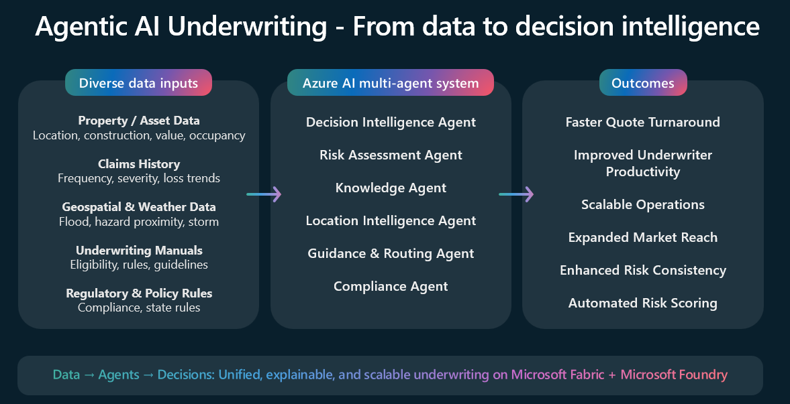
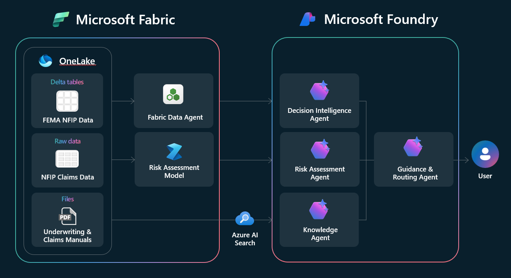
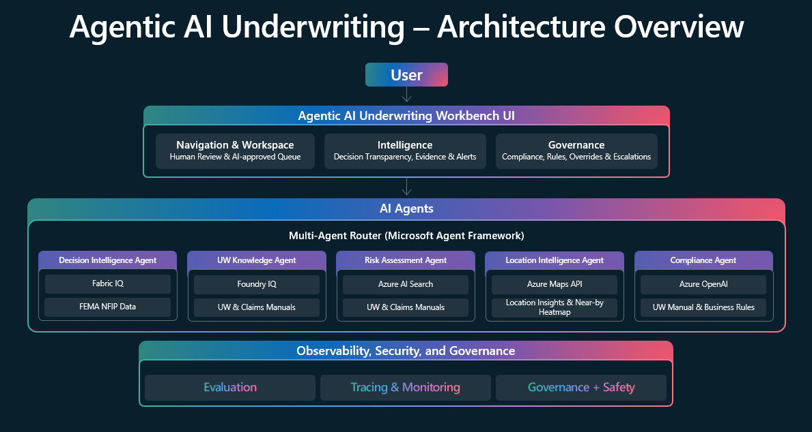

# Agentic Underwriting

An end-to-end underwriting copilot experience that combines a web UI with an agentic backend to accelerate case review, surface key risk signals, and produce explainable AI decision support.

## Business Value

- Automated risk scoring and faster quote decisions
- Human review guidance and routing for efficiency and control
- Transparent recommendations with explainability to support review
- Better alignment to policy and compliance expectations

## Solution Highlights

- Web experience optimized for underwriting workflows (case review + AI insights)
- API-first backend enabling copilot-style interactions
- Explainability-oriented outputs (how/why conclusions were produced)

## Key Features

- Case review experience with structured sections
- AI-assisted summaries and decision support
- Location/property intelligence and risk signals (where available)

## Architecture

This section shows two views:

- **Logical architecture**: a high-level view of how data sources feed an agent system to produce user-facing outcomes.
- **Reference architecture**: a more detailed view showing the UI workbench and agent roles.

### Multi-agent Architecture

## How to Use

1. Open the deployed UI URL.
2. Select a case and review the available panels.
3. Trigger AI/copilot actions as exposed in the UI.
4. Review outputs and validate against your underwriting process.

> This repository intentionally avoids publishing environment-specific URLs and secrets.

## Prerequisites (High-Level)

- Deployed UI endpoint (Azure App Service)
- Deployed backend endpoint (Azure App Service)
- Appropriate access to any required AI provider (credentials configured via environment variables in the deployment environment)

## Repository Structure

- `agentic-underwriting-backend/` – Backend API service (FastAPI)
- `agentic-underwriting-ui/` – Frontend web app (Next.js)

## Documentation

- Backend technical docs: `agentic-underwriting-backend/README.md`
- UI technical docs: `agentic-underwriting-ui/README.md`

## Security & Privacy Notes

- Do not commit secrets (API keys, endpoints, tokens).
- Use App Service Configuration / Key Vault (recommended) for secret management.
- Avoid sharing pilot data outside approved channels.

## License
Copyright (c) Microsoft Corporation

All rights reserved.

MIT License

Permission is hereby granted, free of charge, to any person obtaining a copy of this software and associated documentation files (the ""Software""), to deal in the Software without restriction, including without limitation the rights to use, copy, modify, merge, publish, distribute, sublicense, and/or sell copies of the Software, and to permit persons to whom the Software is furnished to do so, subject to the following conditions:

The above copyright notice and this permission notice shall be included in all copies or substantial portions of the Software.

THE SOFTWARE IS PROVIDED AS IS, WITHOUT WARRANTY OF ANY KIND, EXPRESS OR IMPLIED, INCLUDING BUT NOT LIMITED TO THE WARRANTIES OF MERCHANTABILITY, FITNESS FOR A PARTICULAR PURPOSE AND NONINFRINGEMENT. IN NO EVENT SHALL THE AUTHORS OR COPYRIGHT HOLDERS BE LIABLE FOR ANY CLAIM, DAMAGES OR OTHER LIABILITY, WHETHER IN AN ACTION OF CONTRACT, TORT OR OTHERWISE, ARISING FROM, OUT OF OR IN CONNECTION WITH THE SOFTWARE OR THE USE OR OTHER DEALINGS IN THE SOFTWARE

## Contributing

This project welcomes contributions and suggestions.  Most contributions require you to agree to a
Contributor License Agreement (CLA) declaring that you have the right to, and actually do, grant us
the rights to use your contribution. For details, visit https://cla.opensource.microsoft.com.

When you submit a pull request, a CLA bot will automatically determine whether you need to provide
a CLA and decorate the PR appropriately (e.g., status check, comment). Simply follow the instructions
provided by the bot. You will only need to do this once across all repos using our CLA.

This project has adopted the [Microsoft Open Source Code of Conduct](https://opensource.microsoft.com/codeofconduct/).
For more information see the [Code of Conduct FAQ](https://opensource.microsoft.com/codeofconduct/faq/) or
contact [opencode@microsoft.com](mailto:opencode@microsoft.com) with any additional questions or comments.

## Trademarks

This project may contain trademarks or logos for projects, products, or services. Authorized use of Microsoft trademarks or logos is subject to and must follow 
[Microsoft's Trademark & Brand Guidelines](https://www.microsoft.com/en-us/legal/intellectualproperty/trademarks/usage/general).
Use of Microsoft trademarks or logos in modified versions of this project must not cause confusion or imply Microsoft sponsorship.
Any use of third-party trademarks or logos are subject to those third-party's policies.

## DISCLAIMER

This presentation, demonstration, and demonstration model are for informational purposes only and (1) are not subject to SOC 1 and SOC 2 compliance audits, and (2) are not designed, intended or made available as a medical device(s) or as a substitute for professional medical advice, diagnosis, treatment or judgment. Microsoft makes no warranties, express or implied, in this presentation, demonstration, and demonstration model. Nothing in this presentation, demonstration, or demonstration model modifies any of the terms and conditions of Microsoft’s written and signed agreements. This is not an offer and applicable terms and the information provided are subject to revision and may be changed at any time by Microsoft.

This presentation, demonstration, and demonstration model do not give you or your organization any license to any patents, trademarks, copyrights, or other intellectual property covering the subject matter in this presentation, demonstration, and demonstration model.

The information contained in this presentation, demonstration and demonstration model represents the current view of Microsoft on the issues discussed as of the date of presentation and/or demonstration, for the duration of your access to the demonstration model. Because Microsoft must respond to changing market conditions, it should not be interpreted to be a commitment on the part of Microsoft, and Microsoft cannot guarantee the accuracy of any information presented after the date of presentation and/or demonstration and for the duration of your access to the demonstration model.

No Microsoft technology, nor any of its component technologies, including the demonstration model, is intended or made available as a substitute for the professional advice, opinion, or judgment of (1) a certified financial services professional, or (2) a certified medical professional. Partners or customers are responsible for ensuring the regulatory compliance of any solution they build using Microsoft technologies.
